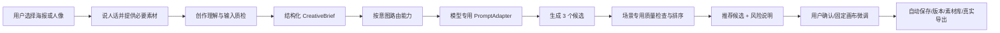

# 生图工作台：海报与人像一次开发定版（2026-07-13）

> 状态：**✅ 客户可用版 V1 已按本文完成实现与功能验证（2026-07-13）；审美与本人相似度仍按本文由人最终判断。**
> 范围：仅生图工作台，核心场景为**海报**与**人像**；不包含剪视频。
> 开发基线：从 `codex/image-workbench-mvp` 分支或提交 `453f5304` 开始，保留用户后续完成的主题配色修改；不要在 `main@861963b4` 的旧版 `CreationPage` 上重复实现。
> 文档权威性：本文件是本轮开发唯一执行入口。此前的生图调研、设计方案、人像风险文档和技术选型文档保留为背景材料；与本文件冲突时，以本文件为准。
> 交付方式：同一个开发窗口完成全部范围、验证和质量门；允许按结构、功能、可靠性拆成小提交，但不接受只交半条链路。
> 本次研究边界：本文依据官方文章和代表性论文定义“怎样生成高质量图片”及产品落法；**当前窗口不运行仓库测试，不用自动评分代替 owner 对画面质量的判断**。后续开发仍必须验证按钮、任务状态和完整功能链路，但这只证明功能可用，不证明生成图“审美合格”。

---

## 1. 最终目标

目标不是让用户学会提示词，也不是做一个 Photoshop/Canva 替代品，而是让没有设计和提示词经验的球房老板或店员做到：

1. 用一句自然语言和少量门店信息，在几分钟内完成可发布海报；
2. 上传已授权的真人随拍素材，用一句话完成自然、好看、无明显 AI 感的照片优化或场景编辑，并尽量保持本人特征；
3. 系统自动完成需求理解、提示词编译、模型路由、候选生成、客观错误筛查和审美辅助推荐；
4. 用户只承担业务信息确认、候选选择和人像“是否像本人”的最终确认；
5. 最终成品的文字、Logo、二维码、尺寸和导出结果是确定性的；
6. 任何自动检查没有执行或无法证明的结论都明确显示为“未检查/需确认”，不得假装通过。

### 1.1 产品成功标准

| 场景 | 用户最少需要做什么 | 系统必须自动完成什么 | 最终人工确认 |
|---|---|---|---|
| 海报 | 说活动内容，必要时补标题/价格/时间 | 理解活动、生成背景、套门店品牌、排版精确文字、叠 Logo/二维码、检查客观可交付性 | 判断画面是否好看并选择稿件，必要时改一处文字 |
| 人像 | 上传 1-3 张已授权照片，说想要的场景/服装/气质 | 输入质检、提示词编译、参考图生成、缺陷检查、人物一致性辅助判断、候选排序 | 一次点击确认“像本人，可以使用” |

---

## 2. 四项不可改变的产品决策

### 2.1 增加“创作理解与提示词编译层”，不是“统一翻译英文”

用户输入先变成结构化创作 Brief，再按场景路由模型，最后由模型适配器生成中文、英文或混合提示词：

```text
用户自然语言/结构化字段/参考图
  -> 素材理解与输入检查
  -> provider-neutral CreativeBrief
  -> 按意图和能力路由模型
  -> provider-specific PromptAdapter
  -> 图片生成/编辑
```

禁止先翻译英文再路由。当前模型路由存在“英文占主导时偏向海外通道”的规则；若先统一翻译，会改变路由、成本和可用性。

### 2.2 海报与人像共享编译层，但使用不同质量链

- 共享：自然语言理解、参考图角色、品牌上下文、模型路由、任务状态、版本和固定画布；
- 海报：重点保证业务文字、Logo、二维码、布局和尺寸准确；
- 人像：重点保证输入可用、肖像授权、人物特征保持、手脸肢体正常、不过度美化；
- 不得用同一个通用“质量分数”替代两套硬性检查。

### 2.3 保留固定尺寸 Fabric 编辑画布，不做无限画布

本轮保留并继续使用现有 Fabric 能力：背景图、文字层、蒙版、拖拽缩放、版本、A/B、原尺寸导出。

本轮不实现无限白板、节点图、任意多个画板散落空间或 Figma/ComfyUI 式工作流。这里取消的是“无限工作区形态”，不是取消画布编辑器。现有实现不会白费。

未来若要管理一组活动物料，可在固定画板外增加“活动画板列表/多尺寸列表”，复用现有项目、版本和图层；不需要推翻本轮架构。

### 2.4 模型维持现有双通道，不升级 Seedream 5.0 Pro

- 国内海报主力继续使用 **Seedream 4.5**；
- 高保真人像、复杂编辑和蒙版编辑继续保留 **GPT Image 2**；
- 不接第三家生图供应商，不自动升级到更贵型号；
- renderer 不显示真实模型或供应商名，只提交业务意图；
- 任何模型替换必须经过固定样例、质量、失败率、延迟和成本复核。

---

## 3. 总体产品流程



### 3.1 首屏只保留两个创作入口

1. **做海报**：用户直接说本次想做什么海报；系统可提供开业、优惠、会员、活动、招聘和日常社媒等快捷起点，但不限制作品类型；
2. **照片优化**：上传 1-3 张已授权真人照片，按用户本次目标做自然美化、换背景、换服装、调整光线或其他图生图编辑。

高级提示词、真实模型名、seed、sampler、steps、负向词等全部不展示。

### 3.2 两种输入方式并存

- **一句话模式（默认）**：用户直接说“做一张周末双人畅打 39.9 元的朋友圈海报”；
- **快速表单模式**：系统从一句话提取字段并填入可编辑表单，用户只改错误内容。

系统应显示简短“AI 理解”摘要，例如“周末活动 / 双人畅打 / 39.9 元 / 朋友圈竖版 / 使用门店 Logo 和二维码”，而不是向用户展示底层英文 Prompt。

### 3.3 PPT 底本的唯一用途与运行时边界

PPT 全文没有提供一套现成的海报模板或 Prompt。它在产品设计阶段能提供的证据，是反复出现的经营事项和素材渠道；据此可以保守归纳常见作图起点：开业/焕新、优惠/团购、会员/充值、比赛/活动、招聘/岗位、日常/社媒。“自由创作”始终是默认项，用户可以制作不属于这些分类的任何海报。

| PPT 原文反复出现的内容 | 可归纳的作图起点 | 只能得到的产品结论 |
|---|---|---|
| 开业筹备、开业案例、门店焕新 | 开业/焕新 | 只提供一个中性类别名 |
| 团购、优惠券、平台商品 | 优惠/团购 | 价格和规则必须由用户本次提供 |
| 会员、充值、储值、一卡通 | 会员/充值 | 不复用 PPT 案例金额和赠送方案 |
| 会员赛、比赛、活动、报名 | 比赛/活动 | 不自动编造赛制、日期和报名费 |
| 招聘、岗位要求、招聘渠道 | 招聘/岗位 | 不自动套人设、薪资和招聘话术 |
| 门店美图、朋友圈、抖音、小红书等日常内容 | 日常/社媒 | 不自动指定平台或内容主题 |

这些分类只帮助用户更快开始，不是六套固定模板。运行时没有读取 PPT 或领域包来补全图片需求的步骤，只能读取用户本次自然语言、用户本次上传的参考图、用户自己的品牌包和明确业务字段。PPT 正文、运营打法、案例数字、默认价格、默认人设和未由用户提供的营销信息不得进入 `CreativeBrief`、Prompt、VLM 质检或项目持久化。

海报既可以是文生图，也可以是图生图：用户没有提供参考图时按本次文字目标生成；用户提供人物、场景、风格、品牌或主体素材时，原图按用户选择的角色直接作为图片条件。系统不得因为作品是球房海报就擅自补球桌、助教、价格、活动规则或营销话术。

助教随手拍是“授权真人照片优化”的高频素材场景，不是海报分类，也不是一个名为“形象照”的固定作品类型。默认路径是图生图：直接上传原始随拍，按用户要求变得自然、好看、无明显 AI 感，也可以换场景、服装、光线或构图；系统不得自动套用职业形象、人设、宣传照或球房背景。这里的高频场景来自 owner 的产品要求，不冒充 PPT 中已经写明的制图结论。

---

## 4. 文献结论：什么决定 AI 生图质量

### 4.1 高质量不是一个总分，而是七个维度

结合 Seedream/OpenAI 官方指南、TIFA、ImageReward、AnyText、IP-Adapter、InstantID 等资料，本产品采用以下质量模型：

| 质量维度 | 高质量表现 | 低质量表现 | 产品控制手段 |
|---|---|---|---|
| 意图忠实度 | 用户要求的主体、数量、动作、环境、颜色、关系都出现 | 漏主体、数量错误、空间关系错、擅自加内容 | 结构化 Brief、硬性问题清单、VLM 逐项核对 |
| 参考图保持 | 人物/产品/风格保留用户指定特征 | 人脸漂移、服装/Logo 被改、风格只剩大概 | 原图直接作为图片条件、明确参考角色和 preserve 项 |
| 视觉审美 | 焦点清楚、构图稳定、光影自然、配色协调 | 主体不突出、画面拥挤、光影冲突、廉价模板感 | 模板构图、模型生成多候选、偏好排序 |
| 真实与结构合理 | 人体、手脸、球杆球桌、透视和阴影合理 | 多指、歪脸、断肢、物体融合、透视崩坏 | 场景专用缺陷检查、失败候选过滤 |
| 文字质量 | 文案准确、可读、位置和层级正确 | 错字、乱码、漏字、重字、融进背景 | 精确文字独立为 Fabric 图层，模型只做视觉背景 |
| 可控编辑 | 只改用户指定内容，其余保持 | 改背景时脸也变、改衣服时构图全变 | change/preserve 分离、局部蒙版、非破坏版本 |
| 可交付性 | 尺寸正确、Logo 不变形、QR 可扫、导出一致 | 预览好看但下载错尺寸、QR 无法扫、字体漂移 | 确定性图层、固定画板、导出前运行时检查 |

TIFA 的研究说明，图像“看起来不错”并不代表“按要求画对”；现有模型仍容易在计数、空间关系和多物体组合上失败。ImageReward 的研究说明，审美偏好又不能只靠传统图文相似度表示。因此质量决策固定采用三层：

1. **先过客观硬闸**：文字、价格、尺寸、文件、Logo 和 QR 等可程序确认的错误直接拦截；
2. **再做 AI 风险筛查和辅助排序**：标记人体异常、参考漂移、指令遗漏和构图问题，但不宣布审美合格；
3. **最后由人选择**：owner/用户判断海报是否好看，本人或授权人判断人像是否相像。

不得让“更好看”的候选覆盖“人物不像本人、价格写错、二维码不可扫”等硬错误。

#### 质量保障分三层，不对 AI 能力过度承诺

| 层级 | 可以做到什么 | 不能冒充什么 |
|---|---|---|
| 确定性保证 | 确保海报文字、价格、Logo、QR、像素尺寸和导出文件正确 | 不代表画面一定高级、好看 |
| AI 风险筛查 | 提示漏元素、人体明显异常、人像可能漂移和构图问题，辅助排序 | 不代表自动判定“高质量”或“就是本人” |
| 人的最终判断 | owner/用户判断审美是否达标，本人或授权人确认人像是否相像 | 不被功能测试、VLM 分数或推荐标签取代 |

因此，“可控且有质量保障”在本产品中的真实含义是：尽可能减少随机错误、用客观规则保证可保证的部分、把有风险的候选提前暴露，并把最少且必要的主观选择留给人。

### 4.2 Prompt 自动改写是正确方向，但必须保持用户原意

Promptist 研究将这一能力称为 prompt adaptation：把普通用户输入自动适配成模型更偏好的提示词，同时用“审美更好”和“保持原意”两个目标约束。OpenAI 的 DALL-E 3 产品与研究说明也采用同一产品机制：用户只说简单想法，ChatGPT 自动产生为图像模型定制的详细提示，再支持用户用几句话继续调整。

这证明本产品应该内置 Prompt 编译层，但同时说明三个边界：

- 编译层不能擅自增加用户没有要求的人物、文字、优惠或品牌元素；
- 编译层不能只追求华丽词汇和审美，必须保存原始意图和硬约束；
- Prompt 是模型相关的派生物，不是用户真相源，用户真相源是结构化 Brief。

### 4.3 长 Prompt 不等于高质量

Seedream 官方指南明确建议用简洁连贯的自然语言描述“主体 + 行为 + 环境”，需要时补风格、色彩、光影和构图；对 4.5 而言，简洁精确通常优于重复堆叠华丽复杂词汇。官方教程建议 Prompt 不超过约 300 个汉字或 600 个英文单词，过长会分散注意并造成元素遗漏。

因此编译器不生产“形容词堆砌 Prompt”，而生产短而结构化的视觉规格：

```text
用途 -> 主体 -> 动作 -> 环境 -> 风格/光影 -> 构图 -> 参考图角色 -> 必须保持 -> 禁止项
```

### 4.4 英文不是高质量的通用前提

Seedream 4.5 官方提示词指南大量使用中文自然语言，并未要求转英文。英文 Prompt 也不是人像专属：语言选择取决于底层模型，而不是海报/人像场景。

本产品固定策略：

- Seedream 4.5 adapter 使用简洁中文；
- GPT Image 2 adapter 默认使用结构化英文 change/preserve 约束；
- 精确中文文案永远保留原值，不翻译；
- 先按业务意图路由模型，再做语言适配；
- 不在用户界面显示或要求用户维护英文 Prompt。

### 4.5 人像身份不能靠文字描述重建

IP-Adapter 的核心结论是，仅靠文字得到目标图像很困难，图片条件与文字条件应当协同。InstantID 等身份保持研究进一步说明，人物一致性依赖人脸图像/身份条件和结构条件，而不是把人物概括为“短发、圆脸、白衣服”。

因此用户照片必须直接作为模型图片输入。VLM 可以理解照片是否清晰、构图和光线是否适合，以及用户希望改变什么，但不得把具体人物只翻译成一段英文后丢弃原图。

### 4.6 输入素材质量决定生成上限

SER-FIQ 等人脸图像质量研究表明，输入脸图是否适合识别/保持，会直接影响下游表现。产品不需要引入人脸识别库或保存 embedding，但必须在生成前检查：

- 分辨率和可解码性；
- 人脸是否清晰可见；
- 是否严重模糊、遮挡、逆光；
- 是否包含多个主体；
- 多张参考图是否可能不是同一人物（只提示，不做身份断言）。

低质量输入不应靠“更长 Prompt”补救，而应让用户换一张更合适的素材。

### 4.7 精确文字需要独立控制

AnyText 研究为了提高多语言文字准确率，专门引入字形、位置、遮罩和 OCR 表征；这反过来说明“只给普通图像模型一句 Prompt”无法稳定保证商业文字。即使 Seedream 4.5 的文字能力更强，门店价格、电话、地址和二维码仍不应依赖概率生成。

所以海报采用：模型生成视觉背景和构图，Fabric 生成精确文字/Logo/二维码。模型文字能力用于创意参考和底图原生文字修复，不承担最终业务信息真相源。

### 4.8 面向用户的最省力高质量流程

综合文献后，质量与低操作成本可以同时成立，关键不是删掉控制，而是把控制放到后台：

```text
高质量输入筛选
  -> AI 把人话编译成结构化 Brief
  -> 模型专用 PromptAdapter
  -> 参考图/蒙版等图像条件
  -> 生成 3 个有差异的候选
  -> 客观硬错误自动过滤
  -> AI 做缺陷风险筛查和审美辅助排序
  -> 用户做最少且必要的最终选择
  -> 确定性文字/Logo/QR 和固定画布导出
```

用户只需要为系统无法替代的事实负责：活动信息是否正确、上传素材是否有授权、人像最终是否像本人。其余工作由系统承担。

### 4.9 海报高质量/低质量判据

| 高质量海报 | 低质量海报 |
|---|---|
| 三秒内能看懂活动主题和核心利益点 | 信息很多但没有视觉层级 |
| 标题、价格、日期、电话完全准确 | 错字、乱码、漏字或模型擅自改价 |
| 用户要求的主体、活动氛围和目标渠道匹配；若用户明确制作球房海报，画面才体现对应场景 | 是“漂亮通用图”，但没有体现用户本次目标 |
| 主体与文案区域互不争抢 | 人物/球桌压住标题和二维码 |
| 品牌色协调、Logo 原样、QR 可扫 | Logo 被重绘、QR 变形、整图单一色 |
| 导出尺寸、字体和预览一致 | 预览正常，导出后字体漂移或裁切 |

### 4.10 人像高质量/低质量判据

| 高质量人像 | 低质量人像 |
|---|---|
| 第一眼仍能认出是参考图中的本人 | 五官、脸型、年龄观感发生明显漂移 |
| 只改变用户要求的背景/服装/光线 | 换背景时人物、发型、体型一起变 |
| 肤质自然，保留真实细节 | 过度磨皮、塑料感、像另一个人 |
| 手、脸、肢体、球杆接触关系合理 | 多指、歪脸、断肢、球杆穿模 |
| 光影、透视和新环境一致 | 人像像贴图，边缘、阴影或色温不匹配 |
| 无额外人物、文字、水印 | 模型擅自增加人物、Logo 或乱码 |
| 自动筛选后仍由用户确认“像本人” | AI 自己宣布“百分百本人/可商用” |

### 4.11 “系统 + Prompt + 画布”融合方案有效性审计

#### 确定结论

1. **这种融合方式可以形成真正的质量保障机制**，但保障的是输入、意图、参考条件、客观错误、可编辑性和交付的全流程，不是承诺每次模型采样都一定好看。
2. **前置流程的方向是正确的**：素材检查、结构化 Brief、provider-specific Prompt、参考图/蒙版、多候选、风险筛查和人工确认会共同提高成功率；只做一次 Prompt 扩写不构成质量保障。
3. **该流程能更充分地发挥生图模型的上限**：它减少了模糊意图、错误语言、丢失参考关系和全图重生成带来的损失；但它不能超越 Seedream 4.5/GPT Image 2 本身的生成上限。
4. **在本产品的用户、场景、成本和模型约束下，这是当前最优的实用方案**；更严格地说，它是“质量、可控性、用户精力、成本”之间接近 Pareto 前沿的产品折中。这是结合论文证据和当前业务约束得出的工程判断，不是对所有行业和专业工作流的绝对最优证明。

#### 论文证据与本产品的对应关系

| 研究证据 | 论文结论 | 对本方案的含义 |
|---|---|---|
| Promptist | 自动把普通用户输入适配成模型偏好的 Prompt，在保留原意的同时，人类偏好结果优于人工 Prompt 工程 | 应该内置 Prompt 编译层，用户无需学 Prompt；但必须保留原始意图和结构化硬约束 |
| PromptCharm | 新手编写和反复修改 Prompt 负担高；“自动优化 + 可视交互 + 局部重绘”的混合式系统，在用户研究中优于缺少交互或可视化的变体 | 对话/自然语言和工作台/画布应融合成反馈闭环，不应只保留一次性生图命令 |
| Composer / ControlNet | 单纯文本生成的可控性有限；文本、布局、深度、草图、姿态、边缘等多条件可组合提升可控性 | 参考图角色、蒙版、比例、模板布局和 preserve/change 不是附加项，而是比“更长 Prompt”更有效的控制条件。这两篇论文支持原理，不代表本轮要新增 ControlNet 供应商 |
| Prompt-to-Prompt | 只改很小一段文字也可能让整张图完全变化，受控编辑需要保留未修改内容或用空间蒙版定位 | 整图修改必须明确 change/preserve，可局部解决的问题优先画布图层或蒙版编辑，不重画整张 |
| InstantID / IP-Adapter | 人物一致性和参考语义依赖图像条件，不能由文字外貌描述替代 | 人像原图必须作为真实图片输入，Prompt 只表达改什么/保留什么，不负责“用英文重建这个人” |
| AnyText | 准确文字需要字形、位置、蒙版和 OCR 等专门控制 | 海报的价格、日期、电话、Logo 和 QR 必须进入 Fabric 确定性图层，不能靠 Prompt 要求模型“尽量写对” |
| TIFA / ImageReward | 指令忠实度和人类审美偏好是不同的质量维度；现有模型在计数、空间关系和多对象组合上仍会失败 | 必须先过客观硬闸，再做 AI 风险筛查/偏好排序，最后由 owner/用户判断主观质量；一个总分不能宣布“质量已保证” |

#### 质量不由一个模块产生，而由闭环产生

```text
可交付质量
  = 输入素材质量
  × 用户意图完整性
  × 底层模型能力
  × 文本/参考图/蒙版条件的可控性
  × 候选筛选和反馈修改
  × 画布确定性收尾
  × 人的最终确认
```

上式是用来定位短板的概念模型，不是可用一个自动总分精确计算的数学公式。

这是一条“短板链”，不是简单加分。任一关键因素接近零，最终交付就会失败：例如人像参考图模糊，Prompt 再好也无法保证像本人；海报背景再好看，价格错了也不可交付。

系统层的职责是把这些短板串成一条链路；Prompt 编译层负责减少意图到模型之间的损失；画布负责把模型的概率性结果变成可编辑、可恢复、可精确导出的成品。三者不是并列功能，而是同一个质量闭环的不同阶段。

#### “融合一体”的正确工程含义

- **产品上是一体的**：同一项目、同一 `CreativeBrief`、同一组资产和版本链，用户从“说想法”到“导出成品”不需要换工具或重新输入上下文；
- **工程上必须分层**：系统编排、Brief 编译、PromptAdapter、模型路由、质量状态和 Fabric 画布仍是清晰独立模块；
- **统一的是数据和用户旅程，不是把所有代码塞进一个页面**；
- Agent `/生图` 和工作台共用同一套 Brief/编译/路由能力；Agent 可以帮用户自动完成前面步骤，工作台承接候选选择和精确收尾。

#### 为什么这是当前约束下的最优方案

| 方案 | 用户精力 | 可控性 | 可交付性 | 是否适合本轮 |
|---|---:|---:|---:|---|
| 只用对话/斜杠命令直接生图 | 最低 | 低 | 低，很难精确改字、Logo、QR 和局部 | 只适合快速草图，不能独立承担海报/人像交付 |
| 只用手动画布 | 高 | 高 | 高 | 违背“普通用户少花精力”目标 |
| Prompt 编译 + 模型，无画布闭环 | 低 | 中 | 中低 | 能提升首次结果，但错字、局部改动和导出仍不可靠 |
| 无限画布/节点工作流 | 高 | 很高 | 高 | 适合专业探索，但增加学习成本，不会直接提升底层模型质量 |
| 自然语言 + 系统编译 + 图像条件 + 候选筛查 + 固定画布 | 低 | 高 | 高 | **本轮定版：最符合海报/人像和普通用户** |
| ControlNet/LoRA/节点编排的专业生产线 | 很高 | 最高 | 取决于专业操作 | 对精确姿态/产品广告可更强，但超出当前用户、成本和供应商范围 |

固定画布不是对无限画布的功能缩水，而是针对“最终交付是一张固定尺寸海报/人像”的任务约束。它减少选择和管理成本，同时保留局部重绘、图层、版本、A/B 和原尺寸导出。

#### 该结论成立的七个前提

1. `CreativeBrief` 是唯一意图真相源，用户能看到并修正“AI 理解”；
2. 必须先路由 provider，再适配 Prompt 语言，不做全局英文翻译；
3. 人像/产品/风格原图必须以有角色的真实图像条件发送，不被文字描述替代；
4. 默认生成有差异的多候选，先拦客观错误，AI 排序只是建议；
5. 海报业务文字、Logo、QR 和尺寸必须由 Fabric 确定性管理；
6. 修改必须保留原 Brief、参考图、版本和 preserve/change 边界，不让用户每次重写需求；
7. 海报审美和人像相似度最终由人确认，未经确认不宣布“高质量/本人/可商用”。

若上述任一关键前提被省略，这套方案就只是把几个界面放在一起，不能称为质量保障闭环。

#### 用户实际需要付出的精力

默认主路径只保留三次人必须参与的决策：

1. 用自然语言说目标，并提供必要素材；
2. 确认系统提取的关键业务信息/人像改动边界；
3. 在建议候选中做最终选择，人像再确认“像本人”。

画布对普通用户是可选精修层，不是每次都必须手工操作的起点。系统应自动承担素材检查、Brief 编译、Prompt 适配、模型路由、生成、客观硬闸、候选建议、版本和导出。这才是融合方案能显著降低用户精力的原因。

---

## 5. 创作理解与提示词编译层

### 5.1 为什么必须做成后端共享能力

现状中，Agent 工具描述要求 Agent 扩写视觉提示词，但工作台直调直接把用户文本发送到 `/studio/generate`；两条入口质量策略不一致。新的编译层必须由 `media/studio` 主责，供以下消费者共用：

- 工作台“生成/整图修改/局部修改”；
- 对话 `/生图`、`generate_image`、`edit_image`；
- 后续“把人像做成海报”的跨场景动作。

工作台不需要让 Agent 参与每次操作；工作台和 Agent 只共享应用服务。

### 5.2 编译顺序

固定采用以下顺序，不允许颠倒：

1. 解析原始用户请求和结构化字段；
2. 读取门店品牌包和参考图角色；
3. 形成 provider-neutral `CreativeBrief`；
4. 做海报/人像输入校验和必要合规闸；
5. 根据 `scene + operation + quality + ratio + availability` 路由模型；
6. 由该模型的 PromptAdapter 生成最终提示词；
7. 调用生成服务；
8. 执行场景专用结果质检并持久化。

### 5.3 编译器输入

- 原始中文请求 `user_request`；
- `scene: poster | portrait`；
- 输出渠道/比例/数量/质量档；
- 门店名称、品牌色、Logo、二维码、品牌参考图；
- 用户参考图及其明确角色；
- 海报精确文案字段；
- 人像操作与必须保持项；
- 上一版本和本轮只修改项（编辑场景）。

### 5.4 参考图必须有角色

不得把所有图片都塞成无语义 `reference`。至少支持：

```text
portrait_subject  本人/主体人物
source_image      本轮编辑底图
style_reference   只参考风格、色彩、光影
scene_reference   只参考环境/构图
brand_reference   只参考品牌视觉
logo              使用原始文件做确定性图层
qrcode            使用原始文件做确定性图层
```

用户侧不需要看到技术名。海报里显示“人物素材/风格参考/门店素材”；人像里第一张默认“本人主参考”，其余可选“补充角度”。

### 5.5 Provider-neutral CreativeBrief

新增共享 Zod Schema，至少包含：

```ts
{
  schema_version: 1,
  scene: 'poster' | 'portrait',
  user_request: string,
  output_use: 'moments' | 'group' | 'poster' | 'rollup' | 'profile' | 'other',
  ratio: string,
  quality: 'draft' | 'standard' | 'final',
  reference_assets: Array<{ asset_id: string; role: ReferenceRole }>,
  visual_direction: {
    subject?: string,
    action?: string,
    environment?: string,
    style?: string,
    color?: string,
    lighting?: string,
    composition?: string,
  },
  must_preserve: string[],
  must_avoid: string[],
  poster?: PosterBrief,
  portrait?: PortraitBrief,
}
```

`CreativeBrief` 是项目可恢复的业务真相源。底层 provider Prompt 是派生数据，可记录编译版本和语言用于诊断，但不作为用户编辑真相源。

### 5.6 提示词语言策略

#### Seedream 4.5

- 默认编译为简洁、连贯的中文自然语言；
- 顺序固定为：用途 -> 主体 -> 行为 -> 环境 -> 风格/色彩/光影 -> 构图 -> 参考图角色 -> 保持项/禁止项；
- 建议控制在官方推荐的 300 个汉字以内；
- 关键文字若确实交给模型渲染，放在双引号中；本产品默认由 Fabric 确定性排版，不依赖模型写准；
- 不堆“8K、杰作、极致、超高清”等空泛词；官方建议简洁精确优于重复华丽词汇。

#### GPT Image 2

- 视觉描述和 preserve/change 约束默认编译为结构化英文；
- 精确中文文案保留原值，不翻译；海报仍由 Fabric 排版；
- 编辑提示必须明确 `change only ...`、`preserve ...`、`do not change anything else`；
- 多参考图按 Image 1/2/3 写清角色和交互；
- 高保真编辑参数必须以最新官方 API 和 relay 实测为准。

#### 禁止事项

- 不允许“所有请求统一翻译英文”；
- 不允许翻译店名、价格、电话、地址、活动标题；
- 不允许将人物身份只转成“圆脸、短发、白衣”等文字后丢弃原图；
- 不允许让提示词语言反向改变模型路由；
- 不允许把编译失败当成生成成功。

### 5.7 编译器实现与降级

- 结构化快捷分类和明确业务字段优先用确定性规则编译，不必每次调用语言模型；
- 自由文本用现有网关文本/多模态模型输出严格 JSON，再由 Zod 解析；
- 有参考图时，VLM 只补充构图、光线、素材可用性和参考角色，不把人脸转为可持久化生物特征；
- 编译结果按原始请求、结构化字段和参考图哈希缓存，同一次候选生成只编译一次；
- 编译模型不可用时：海报退回中性字段规则；真人照片优化可继续但标“未完成自动素材理解”，不得标推荐/可商用；
- 编译低置信或缺失关键业务字段时只询问一个最必要问题，不启动付费生图。

---

## 6. 海报质量链

### 6.1 用户流程

1. 选择“海报创作”或直接输入一句话；
2. 系统从用户本次表达中提取主标题、优惠/价格、日期时间、地址、电话、CTA；未提供的字段保持为空；快捷分类只有用户主动选择时才记录，不从文本自动猜测；
3. 用户最多补一个真正缺失的关键字段；
4. 系统显示本次使用的门店名称、品牌色、Logo、二维码；
5. 生成三张无乱码的视觉背景候选；
6. 系统自动套用精确文字、Logo 和二维码图层；
7. 自动筛查明显风险并给出建议候选；
8. 用户可以直接下载，或进入固定画布做微调。

### 6.2 首期可选快捷分类

默认提供“自由创作”，并提供六个从 PPT 底本保守归纳的可选起点：

1. 开业/焕新；
2. 优惠/团购；
3. 会员/充值；
4. 比赛/活动；
5. 招聘/岗位；
6. 日常/社媒。

快捷分类只提供一个中性的起始意图，不附带价格、活动规则、人设、CTA、球房背景或其他运营内容。用户自然语言和实际参考图始终优先；选择“自由创作”时不做任何领域补全。

### 6.3 模型与确定性排版的职责边界

| 内容 | 由模型负责 | 由确定性图层负责 |
|---|---|---|
| 用户本次要求的主体、场景、光影和创意视觉 | 是 | 否 |
| 标题、价格、日期、电话、地址、CTA | 默认否，只要求预留区域 | 是 |
| Logo | 可作为品牌风格参考，但不得替代原图 | 使用原文件 |
| 二维码 | 不发送给模型重画 | 使用原文件并保持静区 |
| 装饰性短词 | 可选，但默认无文字背景 | 可编辑图层优先 |

背景 Prompt 必须要求“无可见文字、无乱码、无水印，并为标题/价格/二维码预留清晰区域”。若候选仍出现明显乱码或无关文字，质检降级或自动重试一次。

### 6.4 海报自动质量闸

#### 硬闸（任一失败不得标“推荐”）

- 不是占位预览，是真实可读取的栅格图片；
- 像素尺寸与比例正确；
- 所有必填业务文案均存在于受控文字层，值与 `PosterBrief` 完全一致；
- 文字未越界、未被裁切，最小字号符合模板要求；
- Logo 保持宽高比且未被拉伸；
- 二维码使用原始素材、有白色静区、尺寸达标，并能被二维码解码库读取；
- 导出前字体加载完成，导出后文字位置与预览一致；
- 不存在被模型生成的明显乱码/无关水印覆盖主体。

#### 软排序

- 活动主题和视觉一致；
- 视觉焦点清楚；
- 文案区域对比度足够；
- 主体没有明显畸形；
- 品牌配色协调但不被单一颜色淹没。

若三张中不足两张通过硬闸，系统最多自动补生成一次；仍不足时展示可用结果和明确风险，不无限烧成本。

### 6.5 海报编辑

保留现有整图修改、矩形/笔刷局部重绘、文字层、版本和回滚。新增受控 `image_layers`，首期只支持 Logo、二维码和用户选择的人像素材：移动、等比缩放、旋转、角落定位、层级和删除。

模型编辑只改变视觉底图；确定性业务文字、Logo 和二维码默认锁定并在新版本继续保留，除非用户明确修改这些图层。

---

## 7. 人像质量链

### 7.1 产品边界

真人照片能力定位为“对用户本人或已授权人物素材按本次目标做图生图优化”，不是换脸、深度伪造、明星代言或身份冒充工具。

首期支持：

- 随手拍自然优化，重点减少明显 AI 感；
- 按用户要求换背景；
- 换服装但保持人物；
- 调整光线、构图和整体气质；
- 轻度自然修饰，不做自动重建人脸。

“形象照”“宣传照”可以是用户主动提出的目标，但不是助教或真人照片入口的默认定义。

### 7.2 用户流程

1. 上传 1-3 张同一人物照片；第一张是主参考，其余是补充角度；
2. 本地读取真实格式、尺寸和大小；VLM 检查人脸数量、模糊、遮挡、光线和主体；
3. 用户一次确认“拥有照片使用授权，被拍者同意用于本次生成”；
4. 用户自由描述本次目标，例如“把这张随手拍调得自然好看一些，保留本人，不要有明显 AI 感”；
5. 编译层形成“允许改变项”和“必须保持项”；
6. 原始参考图直接作为模型图片输入，不能只用文字描述人物；
7. 生成三张候选；自动过滤明显缺陷并按人物保持优先排序；
8. 默认展示推荐稿，同时提供与主参考图的并排对比；
9. 用户点击“像本人，可以使用”后，状态才进入最终确认；
10. 可一键“用这张照片做海报”，进入海报质量链。

### 7.3 真人照片 Prompt 规则

必须明确：

- Image 1 是主身份参考；其他图片是补充角度，不是不同人物；
- 允许改变：背景、服装、光线、姿态或用户明确要求的内容；
- 必须保持：面部可辨识特征、发型/发色（除非明确修改）、肤色、体型比例、年龄观感、人物数量；
- 禁止：额外人物、额外手指/肢体、塑料皮肤、过度磨皮、无关文字、Logo、水印；
- 编辑时重复声明“只改指定内容，其余保持不变”，降低多轮漂移。

不得将人脸转成一段英文外貌描述后丢弃原图；文字描述无法代表具体身份。

### 7.4 人像输入硬闸

- 图片必须真实解码，不只信任 MIME 和扩展名；
- 单张不超过上游限制，前端在上传前提示；
- 短边低于 512px 拦截，512-767px 警告，建议至少 768px；
- 主参考必须能看到清晰人脸；
- 多人图、严重遮挡、明显失焦、严重欠曝/过曝给出替换建议；
- 参考图疑似不是同一人物时只提示用户核对，不做身份断言；
- 未确认肖像授权不得进入付费生成。

### 7.5 人像结果质检

#### 自动缺陷风险筛查

- 手指/手部明显异常；
- 五官错乱、糊脸、双瞳、牙齿异常；
- 多肢、断肢、关节反向；
- 出现额外人物或人物数量错误；
- 明显塑料感、过度磨皮或年龄漂移；
- 未要求的文字、Logo、水印；
- 输出无法读取、尺寸错误或占位图。

#### 参考图-成图一致性辅助检查

- VLM 同时读取主参考和候选图，只返回 `preserved | uncertain | drifted`；
- 不生成、不保存人脸 embedding，不建立人脸库，不做跨用户身份检索；
- 一致性判断只用于本次候选过滤和排序，不作为法律身份认证；
- 排序优先级固定为：人物保持 > 硬性缺陷 > 指令遵循 > 构图美观；
- `drifted` 不得成为推荐稿；`uncertain` 必须提示人工比较。

#### 最终状态

废弃“自动质检通过就直接 `commercial_ready=true`”的逻辑，改成：

```text
blocked          输入/授权/硬性缺陷不通过
risk             有漂移或未完成自动检查
recommended      未发现明显风险，等待用户确认是否像本人
user_confirmed   用户确认像本人，可以进入最终导出
```

只有 `user_confirmed` 才能显示“人物已确认”；应用不得仅凭 VLM 声称“百分百是本人”或“绝对可商用”。

### 7.6 人像失败和自动重试

- 若三张全部因硬性缺陷失败，自动重试一次并强化 preserve/avoid 约束；
- 若有一张以上可用，不自动继续烧成本，只推荐最佳结果；
- 海外高保真通道不可用时，自动切国内参考图通道并给中性提示；
- 自动质检不可用时可以继续生成，但结果状态只能是 `risk`，必须人工确认；
- 用户选择“这一张不像”时，系统带原 Brief 和漂移原因重生成新版本，不要求用户重写提示词。

---

## 8. 模型路由与成本控制

| 场景 | 主路由 | 失败回退 | Prompt 语言 | 说明 |
|---|---|---|---|---|
| 海报背景/中文营销视觉 | Seedream 4.5 | GPT Image 2 standard（仅主路失败） | 中文；回退适配器英文/混合 | 精确字由 Fabric 负责 |
| 用户参考人像高保真编辑 | GPT Image 2 | Seedream 4.5 参考图编辑 | 英文 preserve/change；回退中文 | 原图始终作为图片输入 |
| 纯文字虚拟人物（非具体真人） | Seedream 4.5 | GPT Image 2 | 中文 | 不触发具体肖像授权闸 |
| 局部重绘/复杂内容编辑 | GPT Image 2 | Seedream 4.5（上游契约支持时） | 英文；回退中文 | 蒙版规则由 adapter 适配 |
| 文字修正 | 优先不用模型，改 Fabric 文字层 | Seedream 4.5（仅底图原生文字） | 中文 | 避免反复重画整张图 |

成本规则：

- 默认候选数 3，不超过 4；
- Prompt 只编译一次，多候选复用；
- 自动补生成最多一次；
- `draft/standard/final` 只影响内部质量与尺寸，不暴露供应商；
- 主路由健康时不双发两个模型；
- 失败回退、重试次数、生成张数和单次耗时写入内部诊断，不向用户泄露 provider；
- 不引入 Seedream 5.0 Pro，不因供应商发布新版本静默升级。

### 8.1 GPT Image 2 高保真契约复核

当前代码注释和旧实现认为 `gpt-image-2` 不接受 `input_fidelity`；但 2026-07-13 核验的 OpenAI 官方模型页明确写有 high-fidelity image inputs，官方 prompting cookbook 的 `gpt-image-2` 精确编辑示例使用了 `input_fidelity: high`。

开发时必须：

1. 核对开发当日的 OpenAPI/官方指南，以当时的正式契约为准；
2. 让 `input_fidelity` 作为可选能力完整通过 desktop -> gateway -> relay，不在中间层丢弃或改名；
3. 首次调用时记录端点对该能力的接受结果，接受则启用高保真人像路径；
4. 若当前部署端点拒绝，自动降级为标准图片输入并标记为 `risk`，不向用户伪称已高保真；
5. 能力结果绑定实际部署端点/模型快照并可刷新，不能永久沿用旧注释。

---

## 9. 固定画布、项目与导出

### 9.1 固定画布

- 每个项目当前只有一个固定像素画板；
- CSS 只缩放显示，不改变源坐标；
- 画布支持缩放/平移查看，但边界仍是输出画板；
- 背景图、文字层和受控图片层分离；
- 蒙版对象不进入最终导出；
- 不持久化未经筛选的任意 Fabric JSON。

### 9.2 项目状态

项目至少持久化：

- `CreativeBrief` 和编译版本；
- 当前版本、父版本、模型生成/编辑任务；
- 背景图、原始尺寸和比例；
- 受控文字层和图片层；
- 参考图资产 ID 和角色；
- 人像授权状态、质量检查状态和用户确认状态；
- 导出资产和素材库条目；
- 自动保存 revision/updated_at。

旧项目缺少新字段时采用 Zod default 正常读取；新增字段优先 optional/default，不做前后端手写镜像。

### 9.3 自动保存与并发

- 图层修改后 800ms 自动保存，显示“保存中/已保存/保存失败”；
- 切换项目、切回聊天、关闭窗口前刷新未完成保存；
- Store 对同一项目的读改写必须串行化，防止自动保存、版本新增和导出互相覆盖；
- library index 同样串行写入并通过 Schema 解析旧条目；
- 版本生成失败不得覆盖当前版本或删除旧产物。

### 9.4 真实导出

- “导出 PNG”必须触发真实文件下载，不只是写入内部 uploads；
- 文件名使用清洗后的项目名和时间；
- 导出完成前由应用确认 PNG 可解码、像素尺寸符合画板且关键图层已合成，失败时不交付损坏文件；
- 导出前等待字体加载，导出后确认 QR 可解码、Logo 未变形；
- 继续提供“保存素材库”，并修正选择 export asset 时宽高元数据必须来自该资产；
- 对 AI 生成/编辑内容的标识和来源信息遵守实际部署地区、上游服务和产品合规策略，不得无条件删除上游要求保留的标识。

---

## 10. UI 信息架构

### 10.1 海报

```text
默认：一句话/参考素材/可选精确文字 -> 确认理解 -> 候选/推荐 -> 直接下载
精修：创作栏 | 固定 Fabric 画布 | 修改、图层、版本与质量检查器
```

### 10.2 照片优化

```text
默认：主照片/补充角度/一句话要求/授权确认 -> 原图与候选比较 -> 本人确认
精修：按用户选择进入同一固定 Fabric 画布，不是照片生成的必经步骤
```

### 10.3 响应式桌面布局

- `>=1500px`：创作栏、主画布、检查器三栏；
- `1180-1499px`：创作栏 + 主画布，检查器以受限宽度下置；
- `840-1179px`：单栏分步视图；
- `720-839px`：创作/画布/编辑三个页签；
- 最低 `720x480` 不得页面级横向溢出；
- 浅色和深色主题使用现有 token，不回退硬编码蓝色/白色；
- 不把功能说明、模型名或技术提示词长期堆在页面上。

### 10.4 与主应用的设计语言

- 继续使用现有浅/深主题和浅蓝强调 token，不为工作台建立第二套配色；
- 默认创作态沿用主应用输入区的圆角、阴影、字号和工具行密度；
- 生成后使用扁平工具面、细分隔线和紧凑命令，只有候选缩略图和 Fabric 画布作为真实媒体/工具边界被框定；
- 不使用大面积满宽按钮、层层嵌套卡片、独立蓝色面板或一串灰色状态胶囊；
- 已有项目启动时只列出，不自动打开固定画布，确保精修层保持可选。

---

## 11. 契约和模块边界

### 11.1 改动说明

```text
改动类别：FULLSTACK + CONTRACT + CROSS_SERVICE + SECURITY
唯一主责模块：media/studio 下的 image workbench
用户行为：用户用自然语言和素材完成海报/人像，系统自动编译、生成、质检、推荐和保存
```

### 11.2 完整调用链

```text
入口 A：/生图 -> Agent image tool
入口 B：/生图工作台 -> CreationPage
  -> studioApi/workbenchApi
  -> shared Zod request
  -> studio route
  -> ImageBriefCompiler
  -> poster/portrait preflight
  -> ImageModelRouter
  -> SeedreamPromptAdapter | GptImagePromptAdapter
  -> MediaJobService
  -> gateway/relay/provider
  -> poster/portrait result QC
  -> ImageWorkbenchStore
  -> shared Zod response
  -> candidate/recommendation/canvas/export UI
```

### 11.3 契约位置

所有跨 renderer/sidecar 的字段放 `ts/shared/contracts/image-workbench.ts`，至少新增或扩展：

- `imageCreativeBriefSchema`；
- `posterBriefSchema`；
- `portraitBriefSchema`；
- `imageReferenceRoleSchema`；
- `imageWorkbenchImageLayerSchema`；
- `imageQualityDecisionSchema`；
- 项目保存 revision；
- 人像 `blocked/risk/recommended/user_confirmed` 状态；
- 用户确认请求 Schema。

Provider 专用 Prompt、真实 model/provider、token、base URL 和路由原因留在 sidecar/gateway 内部，不进入 renderer 公共契约。

### 11.4 预计模块

以下是责任边界，不要求把所有代码塞进一个文件：

```text
ts/shared/contracts/image-workbench.ts
ts/src/media/imageBriefCompiler.ts
ts/src/media/imagePromptAdapters.ts
ts/src/media/posterQuality.ts
ts/src/media/portraitQuality.ts
ts/src/media/imageWorkbenchStore.ts
ts/src/media/imageWorkbenchRoutes.ts
ts/src/media/mediaJobs.ts
ts/desktop/renderer-react/src/features/image-workbench/*
ts/desktop/renderer-react/src/api/studio.ts
gateway/app.ts（仅契约透传确有变化时）
relay/app.ts（input_fidelity/图片编辑契约）
```

`CreationPage.tsx` 已超过合理体量。先做纯结构提交，将页面拆到 `features/image-workbench`，不改变行为；功能提交不得继续把全部逻辑堆回页面。模块新增后同次执行 `maintain-project-skills`。

### 11.5 明确不改

- 剪视频、视频工作台和视频部署链路；
- 通用聊天 Agent 循环的核心协议；
- Office/canvas 文档编辑接口；
- 第三家图片供应商和 Seedream 5.0 Pro；
- 无限画布、节点工作流、多人协作；
- LoRA、ControlNet、训练模型、自动换脸/修脸；
- PSD、CMYK、完整印前系统；
- 与本轮无关的主题、设置、任务和插件页面。

### 11.6 兼容与发布顺序

- 桌面端和 sidecar 同包原子升级；
- 项目 Schema 新字段 optional/default，旧项目可读；
- 若 gateway/relay 契约变化，顺序固定为 `relay -> gateway -> desktop`；
- 新桌面调用新字段前，旧 gateway 必须能忽略可选字段或返回明确不支持；
- 回滚时旧桌面仍能打开旧字段子集，新字段不执行任意代码。

---

## 12. 当前实现必须修正的已知问题

1. 工作台直调没有统一 Prompt 编译层，只把用户文本直接发送；
2. Agent 扩写 Prompt 与工作台直调形成两套质量口径；
3. `prepareStudioImageBody` 主要是追加品牌说明，没有结构化 Brief；
4. 当前参考图大多只有通用 `reference` 角色，多图语义不明确；
5. 人像结果质检检查手/脸/肢体，但没有参考图-成图一致性判断；
6. 当前 `commercial_ready = portrait QC passed` 过于乐观；
7. 上传资产信任声明 MIME、宽高，没有统一解码核验实际格式与尺寸；
8. mask/导出文件大小、实际 PNG 和同尺寸约束需要后端硬校验；
9. 项目和 library index 读改写没有串行化，并发操作可能丢更新；
10. 保存素材库使用显式 export asset 时可能沿用错误版本宽高；
11. `local_preview` 只是本地占位产物，不能代表真实模型结果或被推荐交付；
12. 工作台没有阻止 `local_preview` 被当成正式候选；
13. 固定三栏布局不适配最小桌面窗口；
14. 导出尚未形成“真实系统下载 + 应用内完整性确认”闭环；
15. GPT Image 2 `input_fidelity` 现有注释与最新官方资料存在冲突，必须按实际部署端点做运行期能力兼容。

---

## 13. 安全、隐私和合规边界

- 生图 key、真实 model/provider 和 relay 地址只留 sidecar/gateway；
- 错误、日志、截图和遥测不得包含 key、Authorization、完整 base64 人像或 provider 名；
- 参考图只允许受信 uploads/资产路径，不允许任意本机路径或 SSRF URL；
- 上传端校验 magic bytes、真实尺寸、像素上限、文件上限和解码成功；
- 不保存人脸 embedding、不建立人脸库、不做跨用户身份搜索；
- VLM 人物一致性只用于本次候选排序，不是身份认证；
- 真人照片生成前必须确认肖像授权；公众人物、明星代言、身份冒充等场景按策略拒绝；
- 用户自行上传素材必须确认拥有版权/肖像等必要授权；
- 不把“换脸/深伪”作为产品能力或文案卖点；
- 自动检查失败必须失败关闭到 `risk/unchecked`，不能默认 `recommended`；
- 付费自动重试最多一次；
- 对 AI 生成标识、来源凭证和可商用声明采取保守口径，不能把技术质检等同于法律授权。

本轮跨越参考图上传、远程模型、relay、个人肖像和付费动作，开发时必须执行 `audit-security-boundaries`。

---

## 14. 一次性实施顺序

同一个开发窗口按以下顺序完成，不在阶段之间向 owner 抛新的技术二选一：

### Commit 1：纯结构整理

- 从 `453f5304` 基线提取 `features/image-workbench`；
- 保持现有行为和配色；
- 更新受影响项目 Skill（模块新增/边界变化）。

### Commit 2：共享契约与编译层

- 新增 Brief、参考图角色、质量状态、图片层和 revision Schema；
- 实现编译器、两个 PromptAdapter、缓存和降级；
- Agent 与工作台统一走编译层；
- 路由先于 Prompt 语言适配。

### Commit 3：海报完整闭环

- 一句话/快速表单；
- 自由创作和六个可选快捷分类；
- 品牌包预览；
- 模型背景 + 确定性文字/Logo/二维码；
- 海报硬闸、推荐、自动补生成；
- 自动保存、版本、真实下载和素材库。

### Commit 4：人像完整闭环

- 1-3 张参考图角色；
- 输入质检和授权闸；
- preserve/change Prompt；
- 结果缺陷检查、参考一致性辅助检查、推荐和用户确认；
- “用这张人像做海报”。

### Commit 5：可靠性、跨服务和交付对账

- 上传解码/尺寸/大小校验；
- Store 串行化和素材库元数据修正；
- `local_preview` 阻断；
- GPT Image 2 高保真契约复核及 relay/gateway 兼容；
- 响应式布局、失败/取消/重试；
- 验证海报/人像两条完整功能链路，以及生成、编辑、版本、重试、下载等核心按钮状态；
- 运行时质量状态、跨服务兼容、错误恢复和最终开发对账。
- 执行仓库要求的功能验证与 `bash scripts/quality_gate.sh`；这些结果不得用来宣称生成图的审美质量已自动达标。

---

## 15. 完成定义

以下条件全部满足，才可以向 owner 声明“客户可用版 V1 已完成”：

1. 海报与人像不是两个孤立页面，而是共享编译层、资产、项目、版本和固定画布；
2. 用户不会写 Prompt 也能完成两条主路径；
3. Prompt 语言按 provider 适配，不存在统一英文翻译；
4. 海报精确业务信息由确定性图层保证；
5. 人像原图始终作为参考输入，存在一致性辅助检查和用户最终确认；
6. 无限画布未引入，现有 Fabric 画布能力完整保留；
7. Seedream 4.5 仍是国内海报主力，未升级 5.0 Pro；
8. 旧项目可读，失败/取消/重试/重启不丢产物；
9. 下载、素材库、自动保存和质量状态都是真行为；
10. 海报和人像的运行时质量规则与本文文献模型一致：先过客观硬闸，再做 AI 风险筛查和辅助排序，最后由人判断主观质量；
11. 海报和人像两条完整链路、核心按钮、loading/error/cancel/retry/下载状态均已做功能验证，仓库质量门通过；
12. 最终开发对账列出实际能力状态、成本规则、降级路径和残余风险；
13. 功能验证和 AI 评分不冒充 owner 的审美判断，自动质检不冒充法律授权或本人确认，客观无法确认的结果必须诚实显示为 `risk`；
14. 系统、Prompt 和画布共用同一 Brief/资产/版本链，默认路径只要求用户说目标与上传素材、确认关键理解、选择最终结果；固定画布是可选精修层，不得把人工排版变成每次必经步骤。

---

## 16. 实施与验证对账

### 16.1 Commit 1-5 落地

| 母表顺序 | 实际落地 |
|---|---|
| Commit 1 纯结构 | `fbc958e9` 将现役页面提取到 `features/image-workbench`，兼容页只保留导出；模块地图同步更新 |
| Commit 2 契约与编译 | `cdda662a`、`5ede19fd`、`d42693a0`、`30813ee1` 完成共享 Zod、统一编译、先路由后 Prompt、Agent/工作台共用、自由文本模型理解与确定性降级 |
| Commit 3 海报闭环 | `cdda662a`、`52313767`、`75a817b6`、`6fa241b4`、`30813ee1` 完成自由创作/六类起点、快速表单回填、品牌包、候选、Fabric 文字/Logo/QR、版本、素材库、下载和最终导出硬闸 |
| Commit 4 真人照片闭环 | `cdda662a`、`e0fe6dfd`、`d42693a0`、`30813ee1` 完成 1-3 张授权原图图生图、参考角色、输入检查、逐候选缺陷/漂移、风险提示和 `user_confirmed` |
| Commit 5 可靠性/跨服务 | `55da2d5d`、`52313767`、`75a817b6` 完成上传解码、串行保存、revision、占位阻断、取消/重试、响应式和 `input_fidelity` 可选兼容 |
| 设计语言校正 | `19055927`、`32ae8dd7`、`30813ee1` 复用现有主题 token；将候选、检查和精修区收敛为细分隔线/紧凑命令，移除嵌套预览卡、满宽操作和状态胶囊，并取消启动时自动打开旧画布 |

### 16.2 功能验证结果

- `bun run typecheck`：通过；后端、renderer 和桌面 E2E TypeScript 均通过。
- `bun test`：1818 通过，0 失败；覆盖共享契约、编译/Prompt、上传/存储、海报导出、人像逐候选质检、Agent 工具、server、gateway 和 relay。
- `bun run e2e:backend`：3 通过，0 失败；Agent 工具、落盘、会话隔离与领域包边界通过。
- `bun run e2e:desktop`：9 通过，0 失败；覆盖浅/深主题、720px 最小窗口、快速表单回填、生成/取消/重试、候选/A-B、整图与蒙版编辑、文字撤销重做、版本、自动保存、素材库、真实 PNG 下载、重启恢复、授权随拍图生图和本人确认。
- `bun run check:secrets`：通过；跟踪文件未发现密钥泄漏。
- `bash scripts/quality_gate.sh`：通过；类型、全量测试、前端构建、架构/Skill/工作流/密钥检查全部通过。

这些结果只证明功能链路与客观检查可运行，不证明海报审美、人像相似度或法律可商用性。

### 16.3 模型、成本与降级状态

- 海报主路保持 Seedream 4.5；授权真人参考图、复杂编辑和蒙版主路保持 GPT Image 2；没有新增第三家供应商或 Seedream 5.0 Pro。
- Seedream adapter 输出不超过 300 字的中文视觉规格；GPT adapter 使用结构化英文 `change/preserve`，精确中文文案不翻译且由 Fabric 排版。
- 默认三候选，Prompt/Brief 同批只编译一次；主路健康时不双发；候选不足只自动补生成一次。
- GPT 慢调用默认走 relay 异步 submit/poll。`input_fidelity=high` 完整透传；端点接受记 `accepted`，明确拒绝才去掉字段重试并记 `unsupported/risk`，无法证明时记 `unknown/risk`。
- GPT 主路失败可回退 Seedream 参考图编辑；自动质检不可用时只能是 `unchecked/risk`；本地占位图不可推荐、建正式项目或交付。

### 16.4 未验证项与残余风险

- 本次没有调用真实付费生图端点，未实测实际部署快照的画面质量、延迟、失败率、单张成本和 `input_fidelity` 接受状态；跨服务验证使用假 upstream 和契约测试。
- 海报视觉审美尚未由人验收；真人照片是否像本人必须由被拍者/授权用户在真实图片上确认，自动检查不能替代。
- VLM 缺陷和一致性判断仍可能误报或漏报，因此 `recommended` 只表示未发现明显风险；最终导出不会显示“百分百本人”或“绝对可商用”。
- Fabric 预览排版是确定性的，但不同真实中文字体资产在未覆盖的系统环境上仍需发布前安装包真机抽查；导出边界会拦截尺寸、越界、Logo 变形和二维码不可解码。

---

## 17. 核验来源

- [Seedream 4.0-5.0 提示词指南](https://docs.volcengine.com/docs/82379/1829186?lang=zh)：中文自然语言、用途、风格、引号文字、编辑保持项、参考人物、多图角色和视觉信号；2026-05-11 更新。
- [Seedream 4.0-5.0 官方教程](https://docs.volcengine.com/docs/82379/1824121?lang=zh)：Prompt 建议长度、参考图格式/大小/数量、4.5 standard 优化模式、2K/4K 输出。
- [Seedream 4.5 官方能力页](https://seed.bytedance.com/en/seedream4_5)：参考图面部/光线/色调保持、海报排版和小字、多图编辑。
- [OpenAI Image generation guide](https://developers.openai.com/api/docs/guides/image-generation)：Image API 与 Responses API、生成/编辑、多轮和输出定制边界。
- [OpenAI GPT Image prompting guide](https://developers.openai.com/cookbook/examples/multimodal/image-gen-models-prompting-guide)：Prompt 结构、change/preserve、人物保持、多图角色、精确编辑和生产工作流。
- [GPT Image 2 model](https://developers.openai.com/api/docs/models/gpt-image-2)：当前 snapshot、图片输入、高保真输入、编辑和 inpainting。
- [火山方舟版权和人像素材规则](https://docs.volcengine.com/docs/82379/2525200?lang=zh)：肖像/版权素材限制、商业使用、生成内容标识和用户上传素材授权责任。该规则针对方舟版权和人像素材功能；本产品仍需按实际使用场景和适用法律采取保守合规策略。
- [Canva AI](https://www.canva.com/magic/)：对话理解与手动编辑并存、品牌约束、可编辑布局和尺寸复用的行业方向。
- [Adobe Firefly](https://www.adobe.com/products/firefly.html)：生成后精确编辑、Generative Fill/Expand、Prompt to Edit 和从创意到成品的闭环。
- [DALL·E 3](https://openai.com/index/dall-e-3/)：对话层可以把用户简单想法自动转成适合生图模型的详细 Prompt，支持本文的“用户说人话、系统做编译”方向。
- [Promptist](https://arxiv.org/abs/2212.09611)：在保留用户原始意图的前提下，面向特定生图模型做 Prompt 适配可以提升生成效果。
- [TIFA](https://arxiv.org/abs/2303.11897)：指令/事实一致性与审美质量是不同维度；计数、空间关系和多对象组合是生图常见短板。
- [ImageReward](https://arxiv.org/abs/2304.05977)：人类偏好排名是独立质量维度，支持“硬性正确过滤后再做审美推荐”。
- [IP-Adapter](https://arxiv.org/abs/2308.06721)：图片条件可与文本条件互补，降低用户仅靠文字描述参考对象的负担。
- [InstantID](https://arxiv.org/abs/2401.07519)：人像身份保持依赖图像/身份条件，不能靠把人脸转写成英文外貌描述代替。
- [SER-FIQ](https://arxiv.org/abs/2003.09373)：输入人脸图像的质量会影响后续身份相关判断，支持生成前对清晰度、遮挡、角度和照明做输入检查。
- [AnyText](https://arxiv.org/abs/2311.03054)：可控多语文字渲染需要字形、位置、遮罩和 OCR 式约束，支持海报精确文案放在 Fabric 确定性图层，而不是赌底图模型字正确。
- [PromptCharm](https://arxiv.org/abs/2403.04014)：新手反复编写 Prompt 负担高；自动 Prompt 优化、可视交互和局部重绘构成的混合反馈系统，在用户研究中优于缺少交互或可视化的变体。
- [Composer](https://arxiv.org/abs/2302.09778)：单纯文本生成的可控性有限；文本、布局、深度、草图和色彩等条件可组合提高控制。
- [ControlNet](https://arxiv.org/abs/2302.05543)：在预训练生图模型上加入边缘、深度、分割、姿态等单个或多个空间条件，能提升生成可控性。本文引用其原理，不把它新增为本轮供应商。
- [Prompt-to-Prompt](https://arxiv.org/abs/2208.01626)：文本的小改动可能导致整张图重新生成；受控编辑需要保留未改内容，或用蒙版定位修改区域。
