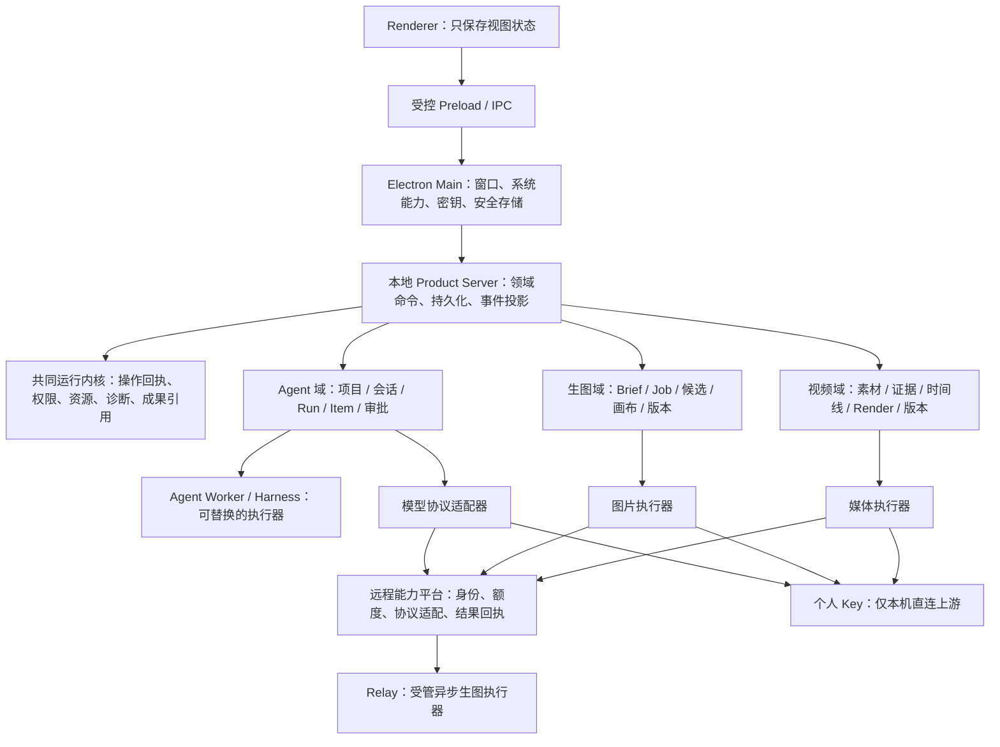

# BilliardBuddy 目标架构与施工顺序

> 状态：架构裁决稿。本文是重构期间的总览和模块边界，不宣称现有实现已经符合本文。
>
> 日期：2026-08-01

## 1. 为什么先写这一份

当前工作树中已经有 Agent、媒体和远程服务的候选实现，但它们不能因为已经存在就自动成为产品地基。重构从用户结果和可核验源码出发：先确定谁拥有什么状态、一次外部操作怎样被确认、各模块怎样独立演进，再决定每段旧代码保留、改造、替换还是退役。

本轮不做两件事：

- 不把现有 `ProductTask`、`MediaProject` 或 Agent Harness 扩张成全产品的万能对象；
- 不把 Codex、WorkBuddy 的 bundle 或整个外部仓库塞入 BilliardBuddy 运行时。

## 2. 已固定的参考依据

| 参考 | 用途 | 明确不做的事 |
| --- | --- | --- |
| 官方 `openai/codex` 源码，commit `ee0247f95a6fe2b094ba2253d82cae2a2b4c2dff` | 学习 App Server 与 Agent Core 的边界：Thread / Turn / Item、事件流、审批、执行和恢复 | 不把 Rust CLI 或 Codex 产品身份当作 BilliardBuddy 运行时 |
| 本机只读副本 `codex-frontend-reference/upstream-cli-ee0247f/` | 让每次实现都能回到同一份源码核对；该目录已被 Git 忽略 | 不进入构建、安装包或发布物 |
| 本机 Codex 桌面前端提取物 `codex-frontend-reference/26.721.41059/` | 学习项目、会话、运行、队列、活动和右侧成果面板的信息架构 | 不复制编译 bundle、品牌、私有 IPC 或云端语义 |
| 本机 WorkBuddy 静态包 | 只学习 Main — sidecar — renderer 的窄能力桥接和请求 ID 通信 | 不移植任何专有实现、协议、鉴权或品牌 |
| 官方 `invoke-ai/InvokeAI` 源码，commit `93fd9ae16e60069d0b78f04720b3c5b0fd0f57d5`；本机只读副本 `invokeai-reference/` | 学习 Canvas Project 的资产/画布分离、候选采纳与持久队列 | 不引入 Python 推理栈、节点工作流、全局图库、`.invk` 格式或品牌 |
| 官方 `OpenShot/openshot-qt` 源码，commit `9cd2b3f3ee9024c3496487a2de30a402515ed659`；本机只读副本 `openshot-reference/` | 学习项目数据、时间线、预览 worker 与独立渲染的边界 | GPL-3.0-or-later 代码只作行为研究，不复制代码、UI、预设、资源或运行时 |
| BilliardBuddy 当前桌面、Gateway、Relay 和媒体实现 | 判断已有资产是否能成为唯一正式路径 | 不因历史文件名冻结架构 |

Codex 与 InvokeAI 的参考源码使用 Apache-2.0；OpenShot Qt 使用 GPL-3.0-or-later。若以后确实复制任何逐行代码，必须先完成适用的许可证与 NOTICE 审计；目前三者都只用于架构和用户旅程判断，不进入产品代码、构建、安装包或发布物。

## 3. 目标架构形态



这里的共同运行内核是很小的“可信执行边界”，不是第四个产品：它没有通用 `Project`、`Task`、画布、时间线或聊天记录。三个领域各自拥有自己的业务模型。

## 4. 状态归属与硬边界

| 所属模块 | 它拥有的最终事实 | 它不能拥有 |
| --- | --- | --- |
| Electron Main | 窗口、受控 IPC、系统能力、安装会话、个人 API Key 的安全存储 | Agent 会话、图片版本、视频时间线、Renderer 业务状态 |
| 本地 Product Server | 领域命令入口、持久化投影、事件恢复、迁移协调 | Renderer 的临时控件状态、个人 Key 明文 |
| 共同运行内核 | 操作 ID、幂等指纹、取消/超时、执行 lease、结果检查点、诊断与成果引用 | 任何领域的 `Project` 或业务工作流 |
| 远程能力平台 | BilliardBuddy 受管能力的安装身份、额度、路由、用量和上游回执 | 用户本机项目、个人 Key、桌面界面状态 |
| Agent 域 | Agent 项目、会话、Run、Item、队列、审批、工具活动、上下文与恢复 | 图片画布、视频时间线、Gateway 配额 |
| 生图域 | 图片项目、参考素材、Brief、生成 Job、候选、画布、版本、导出 | Agent 会话、视频渲染状态 |
| 视频域 | 素材、证据、转写、时间线、预览/渲染 Job、版本、输出 hash | Agent 会话、图片画布 |
| Worker / Harness | 某一次 Agent Run 的模型—工具循环和短生命周期执行上下文 | 用户可见业务真相、长期凭据、最终完成裁决 |

Renderer 只能发出明确命令并订阅领域事件；任何会改变文件、网络、付费调用或外部账户的操作，都必须经过本地服务的操作回执和权限边界。

## 5. Agent Harness 的正确位置

Agent Harness 不是整个 BilliardBuddy 的后端，也不是 Gateway、Relay、生图或视频的上级。它只是 Agent 域中可替换的执行器，职责是：

1. 基于一个已经确定的 Agent Run 快照，运行模型—工具循环；
2. 向父进程请求受控的模型、工具、MCP、Hook、Skills 和子任务能力；
3. 发出可持久化的活动、消息、审批和结果候选；
4. 在被停止、崩溃或断连时留下足够信息让父进程判断“未发生、已确认、还是结果未知”。

它不应直接拥有项目索引、工作区迁移、媒体项目、全局调度、个人密钥或最终状态文件；也不能在外部调用返回后自行宣布 Run 已完成。

因此，现有 Harness 不是先验保留对象。会先按下面的边界审查：能成为上述执行器的部分可保留；把 Agent 领域和其他产品领域揉在一起、或无法正确处理结果未知的部分必须重写或退役。

## 6. 两条模型与服务路径

### 6.1 BilliardBuddy 受管能力

```text
Agent / 图片 / 视频领域
  -> 本地协议适配器
  -> Gateway（安装身份、能力许可、额度、操作回执）
  -> 对应上游协议适配器
  -> 上游服务
```

Gateway 对产品暴露能力，而不是把某一家 provider 变成产品核心概念。受管文本能力必须同时具备 Chat Completions 与 Responses 的明确适配，不允许把 Responses 假装成 Chat，也不允许失败时偷偷换模型或供应商。Relay 继续是受管异步生图的执行器，拥有自己的幂等提交、结果查询和 ACK 语义。

### 6.2 用户明确选择的个人 Key

```text
Electron Main 安全存储
  -> 仅本机 Product Server 的协议适配器
  -> 用户指定的上游
```

个人 Key 不进入 Renderer，不经过 BilliardBuddy 的 Gateway 或 Relay，也不被上传到服务器。它同样需要本机操作回执：网络中断、超时或进程崩溃且无法证明上游未执行时，状态必须是“结果未知”，不能自动重发造成重复扣费或重复外部操作。

## 7. 所有外部操作的完成条件

一次可能改变外部世界的操作不能只分“开始”和“结束”。正式顺序是：

```text
领域服务落盘 intent / operation_id
-> 获得执行 lease 并发出调用
-> 收到上游或本机执行结果
-> 领域服务持久化对应 Item、Job、资产或时间线投影
-> 同 operation_id 写入 checkpoint
-> 才能标记 completed 并清理可重放风险
```

在 checkpoint 之前发生 stop、崩溃、IPC 丢失、超时或连接中断，操作不能被普通“恢复”悄悄重放；必须进入 `outcome_unknown` 或一个可证明没有执行的终态，由用户或可核验证据决定后续动作。这条规则同时约束 Agent 模型/工具、图片远程生成和视频的可外部影响操作。

## 8. 模块文档和施工顺序

| 顺序 | 中文模块文档 | 交付边界 | 与其他模块的关系 |
| --- | --- | --- | --- |
| 0 | `00-目标架构与施工顺序.md` | 本文：源码依据、状态归属、迁移裁决和顺序 | 只规定边界，不产生万能平台 |
| 1 | `共享运行时与桌面壳.md` | 受控 Main/preload/sidecar、操作回执检查点、权限/资源/诊断/成果引用的最小接口 | 只随着第一个 Agent 实际消费者落地，不单独造空壳 |
| 2 | `模型与远程能力平台.md` | 受管与个人直连双路、Chat/Responses 适配、额度与回执 | 给三个领域提供能力，不保存其业务状态 |
| 3 | `通用Agent工作台.md` | 项目/会话/Run/Item、Worker、工具、审批、队列、恢复、Skills/Plugins/MCP/Hooks/子任务 | 第一个端到端正式模块；会推动 1、2 的最小实现 |
| 4 | `生图工作台.md` | Brief、候选、画布、版本、真实异步 Job、质检和导出 | 不接 Agent 会话或 `ProductTask` 总账本 |
| 5 | `视频工作台.md` | 素材证据、时间线、预览/渲染、版本、输出 hash | 不接 Agent 会话或图片画布 |
| 6 | `迁移与发行.md` | 旧路径退役、数据迁移、安装/升级/更新和平台发行 | 只在三条正式路径稳定后开始 |

实际代码提交按可独立验收的用户结果，而不是按目录数量。一笔模块提交必须同时有正式消费者、唯一状态归属、从 UI/API 到执行再到结果投影的调用链，以及中断/重启/重复请求处理；只新增类型、仓库、页面或文档均不算一个模块交付。

## 9. 当前候选实现的初步裁决

| 当前资产 | 初步裁决 | 原因 |
| --- | --- | --- |
| Electron Main、隔离 preload、loopback Sidecar、密钥安全存储 | 优先保留并收紧 | 已接近正确的宿主边界 |
| Gateway 的安装身份、用量/并发、操作回执 | 保留语义并抽成正式远程能力平台 | 这是受管服务真正需要的业务能力 |
| Relay 的异步生图 Job、结果 ACK、未知结果保护 | 保留为图片域的受管执行器 | 与 Agent Harness 无关，且已有重要防重复计费语义 |
| 个人模型的 Chat Completions / Responses 适配 | 保留并统一到 Agent 模型端口 | 已满足用户的本机直连方向，但要以新的 Run 回执闭环接入 |
| 巨型 `ProductTaskService` / `AuthorityRepository` | 不作为共同地基 | 目前把 Agent 项目、任务、工作区、调度等揉在同一总账本 |
| 巨型 `MediaProjectService` | 保留领域语义，后续拆成图片和视频两个正式服务 | 图片与视频状态不能长期靠一个泛媒体总服务维护 |
| 当前 Agent Harness | 作为 Agent 内候选，先验证检查点/恢复边界再决定保留比例 | 目前不能凭存在就算最终执行架构 |

## 10. 实施看板与下一个正式模块（2026-08-01）

| 工作面 | 已形成的可审阅边界 | 不能误称已经完成的部分 | 下一个唯一施工目标 |
| --- | --- | --- | --- |
| Agent | `9d2e1a92` 收口 Agent Run 外部操作回执与 `outcome_unknown`；`b237d7cf` 收口受管文本的 Chat Completions / Responses 路由，个人 Key 仍仅本机直连 | Agent 完整用户旅程、全部工具与完整桌面交互尚未验收 | 留在 Agent 域内按真实入口复审；不再把 Harness 扩张为全产品后端 |
| 生图 | InvokeAI 参考和领域边界已固定；图片项目、CAS 资产、操作 journal、Gateway/Relay 回执、候选/版本/导出、可恢复删除以及 `/images/*` API 已进入独立 `ImageWorkbenchService`。启动时旧服务不再改写旧图片记录，旧目录仅供导入和兼容读取 | 旧泛媒体图片实现仍物理混在视频服务中，历史回收站尚未整体迁移，真实受管上游旅程尚未验收；不得宣称图片模块完成 | 盘点剩余旧消费者和历史回收站支持范围，确认无新图片写入可回到旧服务，再用真实本机文件和受控上游旅程复核恢复、候选采纳、ACK 和导出 |
| 视频 | OpenShot Qt 参考已固定；现有泛媒体服务中的视频语义待盘点 | 没有任何视频域迁移代码 | 等图片模块以正式提交收口后，才开始素材证据—时间线版本—预览/渲染—校验导出的独立路径 |
| 发行 | 发行路线和 Windows 优先级已保留 | 不做安装包、ISO、VM 或 GitHub 发布验收 | 只在三条正式用户路径都稳定后开始 |

从现在开始只允许一个工作面处于施工状态：**生图工作台**。视频、发行和新的“通用平台”工作不并行开工。

图片模块的固定施工顺序如下；每一步都直接与 InvokeAI 的相应用户旅程和现有 BilliardBuddy 调用链对照，但只保留 BilliardBuddy 自己的实现：

1. 定义并落盘图片项目、资产、操作与事件 journal 的唯一事实；
2. 将参考图导入、Brief、提交操作、候选组、明确采纳、画布版本和导出串为一个正式服务；
3. 把 `/images/*` API 和桌面页面切到该服务，使新写入不再经过泛媒体图片分支；
4. 以真实本机文件验证重启恢复、重复提交、未知结果、候选采纳与 hash 导出；不发起付费图片请求；
5. 盘点并迁移仍由旧服务读取的支持数据，删除图片旧写入路径，审计消费者、构建后才做一笔范围明确的图片模块提交。

旧代码不会在没有消费者、数据迁移和运行路径证据前被删除；当前混合工作树也不会被重置或用 `git add -A` 强行收口。
