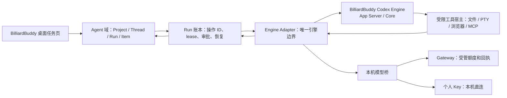

# Codex 源内核迁移

> 状态：Agent 工作台的当前施工模块。已登记固定源码依赖；本文把上游源码变成 BilliardBuddy 自己的可替换执行内核，不把整个 Codex 产品搬进来。

## 1. 已确认的起点

- 上游基线：`openai/codex` commit `ee0247f95a6fe2b094ba2253d82cae2a2b4c2dff`；正式 Git 子模块位于 `third_party/codex-engine/`，其公开来源是 `https://github.com/openai/codex.git`。本机研究副本仍位于 `codex-frontend-reference/upstream-cli-ee0247f/`。
- 上游有成熟的 `app-server`、ThreadState、Turn/Item 事件、审批和工具执行边界；这些正是 BilliardBuddy 当前自研 Harness 最不应继续重复维护的部分。
- 上游默认会组装自己的本机、MCP、扩展和协作工具，单独传 `environments: []` 只能关掉环境，不能关掉整套工具面。产品以 `third_party/codex-engine-patches/0001-host-managed-tools-only.patch` 增加默认关闭的 `host_managed_tools_only` 嵌入模式：此模式只暴露明确注册的动态工具，所有调用通过 `item/tool/call` 回到 BilliardBuddy。`0002-context-compaction-ledger.patch` 则把正常 inline 压缩的来源、输入/输出 token 估计与摘要带回 App Server Item；产品在下一个源码模型采样前把它写入自己的 Run 账本。不能产出可恢复摘要的 TokenBudget 压缩在嵌入配置中明确关闭。
- 此基线的 `codex-rs/model-provider-info/src/lib.rs` 只接受 `WireApi::Responses`，明确拒绝 `wire_api = "chat"`。
- BilliardBuddy 仍必须支持受管和个人模型的 Chat Completions 与 Responses，且个人 Key 只能在本机受控路径中直连。

结论：不是把原版 Codex 二进制直接启动，也不是再写一套相似的 TypeScript Agent 循环；而是从 Codex 源码形成 BilliardBuddy 管理的执行内核，再由本机模型桥和领域适配器接住产品差异。

## 2. 最终架构

### 2.1 每层只负责什么

| 层 | 最终负责 | 明确不负责 |
| --- | --- | --- |
| Agent 域与 Run 账本 | 用户任务、Item、队列、审批、恢复判定、操作回执 | 模型循环细节、图片画布、视频时间线 |
| Engine Adapter | 一个 BilliardBuddy 任务会话与一个 Codex Thread 的绑定；一次 Run 与该 Thread 上一次 Turn 的绑定；事件顺序、取消、服务端请求回应。未开始 Turn 的新 Thread 不作持久恢复状态 | 项目索引、全局密钥、UI 状态 |
| Codex Engine | 一次 Thread 的 Turn/Item/工具循环、上下文、指令与执行状态 | BilliardBuddy 的业务真相、额度、永久凭据、最终完成裁决 |
| 本机模型桥 | 为引擎提供 Responses 语义，保留上游回执和不确定结果 | 伪造 Chat/Responses 等价性或自动重发不确定操作 |
| 工具宿主 | 在权限信封内执行文件、终端、浏览器、MCP 等窄能力 | 绕过 Run lease 或直接修改领域账本 |

图片和视频不进入 Codex Engine。它们保留自己的 Job、候选/画布或时间线/渲染事实；未来只能以明确的成果引用或受限工具交给 Agent，不能把媒体状态塞进 Thread。

### 2.2 引擎状态不是产品状态

Codex 会保存自己的 Thread、配置与运行资料。BilliardBuddy 启动它时只给它一个由产品创建和管理的**私有引擎目录**，绝不复用用户已有的 Codex 目录、登录态或凭据。该目录中的 Thread 是可替换的执行缓存：删除、损坏或升级后，必须由 Agent 域的任务、Run、Item、操作回执和恢复判定重新建立可继续的执行状态。产品账本才是用户可见历史和副作用裁决的唯一事实来源。

## 3. 模型适配的硬规则

引擎只看到 Responses。BilliardBuddy 的模型桥按实际上游协议分路：

1. 上游已经是 Responses：在保留 `operation_id`、完成标记和工具参数完整性的前提下转发。
2. 上游是 Chat Completions：在本机把完整流转为 Responses Item；增量、未完成 `finish_reason` 或不完整 function arguments 不能交给引擎执行。
3. 模型调用先由 Run 账本写入 intent 和 lease；结果先投影为 Item/回执并完成 checkpoint，才会向引擎确认。
4. 连接断开、超时或引擎/桥崩溃时，不能证明上游未执行的调用必须进入 `outcome_unknown`，不会自动重发。
5. 个人 Key 只通过 Electron Main 的安全存储注入一次私有本机会话；Renderer、Agent Item、Codex 配置文件和 Gateway 都不能得到明文。

## 4. 分段施工与提交边界

每一段都必须有正式消费者、唯一状态归属、实际调用链和中断处理；没有这些的类型、空壳或文档不算完成。

| 段 | 唯一交付 | 完成证据 | 不做 |
| --- | --- | --- | --- |
| A. 源码与构建 | 已锁定的 `third_party/codex-engine`、Apache LICENSE/NOTICE 审计，以及 BilliardBuddy 私有目录中的 stdio 引擎客户端和 Thread 绑定存储；macOS/Windows 可构建 `codex-app-server` | 子模块 revision 与上游来源可复现、许可证清单、两平台构建产物可启动 | 不引入 Codex CLI/TUI/品牌；不发布安装包 |
| B. 模型桥 | 引擎只接 Responses，受管与个人 Chat/Responses 都由本机桥提供同一完整 Item 语义 | 无付费替身覆盖文本、工具调用、不完整流和未知结果 | 不读取或上传真实个人 Key；不自动重试 |
| C. Run 事件桥 | 一个 BilliardBuddy 任务会话绑定一个 Codex Thread；每次 Run 在该 Thread 上启动一次 Turn，按顺序投影 Turn/Item、停止和 terminal；审批、工具活动留给 D | 新建任务、继续、停止、重启后历史和状态一致 | 不让引擎直接写任务数据库 |
| D. 权限与工具桥 | Codex 的工具请求受 BilliardBuddy lease 和三档权限控制；引擎仅暴露 BilliardBuddy 动态工具 | 文件、PTY、浏览器、MCP 的许可/拒绝/停止均有可见回执 | 不让工具获得全局凭据或目录外权限 |
| E. 正式切换 | 桌面任务页只消费引擎事件；旧 Harness 无消费者后删除 | 同一用户旅程在新路径完成，旧路径不可再启动 | 不保留双 Harness 作为“兼容” |

当前处于 **D. 权限与工具桥施工中**。固定源码已经登记；开发机已从该基线加受管工具补丁构建 macOS arm64 `codex-app-server`。Worker 中新增一个仅由本地 Product Server 注入的迁移开关 `BB_AGENT_EXECUTION_RUNTIME=codex-engine`：它不暴露给 Renderer，也不是最终用户设置。开启后，实际 Agent Worker 会启动产品管理的 App Server、绑定私有 Thread，并把 `turn/start` 与每次模型结果分别写成 Run 账本回执；模型结果 checkpoint 成功前，本机 Responses 桥不会向引擎发送 `response.completed`。

已用不访问网络、密钥或付费模型的本机假模型验证六类真实源内核路径：一次 Run 完整经过 `started → Thread/Turn → delta → terminal completed`，Turn 与模型两条操作均完成 checkpoint；随后关闭进程、以同一私有 Thread 连续启动第二个 Run，也完成并留下四条 checkpoint；真实源码 Core 可声明 `Read` 动态工具、经 `item/tool/call` 回调 BilliardBuddy、写入工具回执后继续完成同一 Turn；真实源码还已接收 BilliardBuddy 处理后的 PNG 输入，且本机模型桥确认收到图片内容，同时该附件输入的操作 ID、摘要和 Thread/Turn 一起完成 checkpoint；运行中输入在模型请求尚未完成时调用源码原生 `turn/steer`，也已返回同一活跃 Turn，并把队列项、输入摘要与 `engine_steer` 回执写入私有 Thread；最后，首个模型结果被 Stop Hook 阻止时，产品在该结果已经落账、但 `response.completed` 尚未交回源码的窗口，用同一 `turn/steer` 注入独立 `stop_hook_*` 输入，先把提示正文、轮次、摘要和 `engine_steer` 回执写入私有 Thread。源码随后只运行第二次采样并以原 Turn 完成，没有虚构 terminal 或第二个 Turn。工具面先由 Product Host 生成有 SHA-256 的固定声明，在 `mcp_prepare` 账本回执 checkpoint 后才能启动 Turn；每次工具调用又必须先取得 `tools` 操作 ID、由 Host 依据原有权限信封执行、写入私有 Thread 回执并 checkpoint，才会向源码返回结果。

动态 `Subtask` 现已接入同一条源码路径，但它不是在父工具中递归启动旧 TypeScript 模型循环：父 Turn 的 `tools` 操作仍保持 in-flight，BilliardBuddy 账本据此创建一个独立子 Run、独立 Lineage、私有 Codex 状态、执行 claim、模型/工具回执和 terminal 结果。子 Run 不占用户的串行输入队列，也不把内部文字、活动、计划或 terminal 投影到公开 Thread；它完成、停止、需恢复或结果未知后，只把受控结果交还给父工具调用。运行调度允许同一任务的父子 Run 同时持有有限 worker 额度，避免父 Run 等待子 Run 时自锁。已用隔离账本和真实调度器做手工闭环验证，确认子 Run 能独立 claim/terminal、结果只能由拥有父工具操作的父 Run 读取，且公开事件流不含子 Run。

`TodoWrite` 也已进入源码动态工具面：Host 先按既有 schema、权限和工具执行规则返回确定结果；对于成功结果，源码 Core 必须以同一个 in-flight `tools` effect 同步写入计划 Item，之后才能 checkpoint 工具结果并向 Codex Thread 返回成功。计划写入失败会让该 effect 保持不可确认，而不是让“模型已收到成功、任务页没有计划”成为可能。公开投影仍由 Worker 事件桥幂等推送；子 Run 的计划则保持私有。

这些证据只说明 C 及 D 的动态工具、首轮附件、运行中输入、计划投影、可恢复子任务与同步 Hook 主链成立，不等同于完整桌面用户旅程验收；默认正式消费者仍是旧 Harness，切换必须等真实桌面旅程一起验收后一次性进行。

桌面构建不允许再从开发者的 Cargo `target/` 目录启动内核。`stage-codex-engine.ts` 必须在干净、锁定的子仓上按固定顺序应用两份补丁、从源码构建、反序撤回补丁，再把二进制、Apache-2.0 `LICENSE`、上游 `NOTICE` 与包含 revision、整套补丁 SHA-256、目标三元组和二进制哈希的 manifest 一并放进 `runtime-assets/binaries/`。macOS 使用不受代码签名变化影响的 Mach-O 哈希；Windows 使用普通 SHA-256。打包前、afterPack 与安装包审计都会重新验证该清单。Electron Main 会丢弃继承的 `BB_CODEX_ENGINE_BIN_DIR`，只在自己的 `runtime-assets/binaries/` 中存在对应目标二进制时才向本地 Product Server 注入该目录。

`codex-engine-build.yml` 会先核对、顺序应用两份补丁、重新生成并核对受影响的 App Server 协议类型，再在 GitHub 的 macOS Apple Silicon 与 Windows x64 runner 上只编译未经签名的 `codex-app-server`，不生成桌面安装包、不上传发布源；桌面 macOS/Windows 构建工作流则递归取得子仓、安装锁定 Rust 工具链，并在 Electron 打包前执行上述 source-to-runtime-assets 步骤。当前只有 macOS arm64 已有本地真实构建与资源清单证据；由于本地 `main` 尚未安全推送，Windows 构建尚未有实际产物证据。

本次 D 的第一条闭合边界是“源码动态工具 → BilliardBuddy Host”：`Read/Write/Edit/Bash/Web/MCP/Skill/AskUserQuestion/TodoWrite` 等直接工具只作为声明交给源码，实际描述、Schema、执行、三档权限、审批与结果内容都仍由 Host 重新取回和处理；源码进程没有本机 Shell、文件、浏览器、MCP 配置或全局凭据。首轮附件也走同一个宿主边界：路径只在 Host 内部校验和读取，文本文件、视频帧与转写先变为有界文字/图片，源码仅收到文字与 data-URI 图片；`chat_prompt` 的结果摘要和操作 ID 必须先随私有 Thread/Turn 持久化，才可确认该附件操作并放行模型。运行中输入使用上游原生 `turn/steer`：既有队列项先由产品账本拥有，源码接受后 `engine_steer` 的操作 ID、队列 ID 与输入摘要必须写入私有 Thread，才会确认队列已消费；新的源码模型请求会等待该检查点。`TodoWrite` 的成功结果额外要求先同步持久化计划 Item；`Subtask` 例外地拥有独立的子 Run 协调器，而不是复用旧 Harness 的递归循环。命名 Agent 仍不出现在这条动态工具面。引擎尚未接管正式默认 Run；在模型桥、事件桥和权限桥完整之前，不再给旧 TypeScript Harness 添加模型、工具、Hook 或 UI 功能。

### 4.1 当前唯一施工单元：Agent 执行内核替换

这不是把 Harness 继续扩大，也不是一次拆成多个彼此无关的“后端模块”。当前唯一的产品模块是 **Agent 执行内核**；A、B、C、D 是这个模块必须按顺序闭合的内部边界。它结束前，旧 Harness 仍是唯一正式消费者，但只保留现状，不再扩展功能。

1. **产品身份先行**：每个 Run 取得独立的 BilliardBuddy 引擎目录与 Thread 绑定；产品的 Task、Run、Item、操作回执仍在既有账本中，引擎资料只是可丢弃缓存。
2. **模型结果后确认**：Worker 中的本机 Responses 桥只能经既有主进程 IPC 调用模型；主进程继续负责 Gateway 与个人 Key 路由。模型结果完成账本 checkpoint 后，桥才可对 Codex 确认 `response.completed`。
3. **Run 成为 Turn**：一次用户 Run 必须在已绑定 Thread 上启动一次 Codex Turn，把 `turn`、`item`、停止和 terminal 事件依次投影为现有 Agent 事件。没有这条真实调用链的适配文件不算完成，也不能切换 UI。
4. **工具有唯一宿主**：Codex 的工具/审批请求只经 BilliardBuddy 权限信封和现有主进程工具宿主处理；在该桥完成前，引擎不得获得本机 Shell、文件、浏览器、MCP 或任何全局凭据。
5. **一次性切换**：上述边界闭合并走通一条真实用户旅程后，桌面 Agent 页改为只启动新内核，旧 Harness 删除；不长期保留双执行循环。

因此，当前已不只是 Responses 回环端点：C 的受管 Run/Turn 路径、D 的直接动态工具、首轮附件、运行中输入、正式计划投影和可恢复子任务都有明确的产品 Worker 消费者和账本回执，但尚未成为默认消费者。源码模型返回带有 Gateway 或个人 Key 的结果回执时，BilliardBuddy 会先写入私有 Thread 与 TaskRun 的模型检查点，再以独立 `model_ack` effect 由 Host 确认上游结果；确认失败绝不把模型效果伪装为完成。每个已接受的 Run 也会冻结 `.BilliardBuddy` 项目指令的 digest 和正文到同一私有 Thread 绑定，并把正文作为源码模型的受控系统指令；同一 Run 的恢复只会使用原快照，不会因文件后来被改动而悄悄换规则。首轮采样前，Host 还会把实际项目命令、源码动态工具、已连接 MCP、项目指令 digest 和 Hook digest 汇成同一份 `extension_snapshot`；它先随 `mcp_prepare` effect 原子写入 TaskRun 账本、再发出可见扩展活动，源码 Thread 也只保存该快照对应的工具面。`SessionStart` 与 `UserPromptSubmit` 现在在源码 Turn 已被账本确认、但首个 loopback 模型请求仍被阻塞的窗口运行；它们的安全补充上下文会被注入首轮模型指令，阻止结果则中断尚未开始模型的 Turn。D 已把项目 `PreToolUse`、`PostToolUse` 和 `PostToolUseFailure` 的同步 Command/HTTP Hook 接在源码动态工具调用的前后：每个 Hook 都先单独取得 `hook_command` 或 `hook_http` 操作身份、在产品权限信封中执行、写入私有引擎回执并 checkpoint，绝不嵌套在 `tools` 回执内。`prompt` 与 `agent` Hook 同样复用已确认的 Run 模型路由、零工具模型调用、私有引擎 checkpoint 和独立结果确认；它们不能中途切换模型或 Provider。Pre Hook 可阻止工具；Post Hook 只能把受控反馈交给下一次模型，不会篡改已经完成的工具结果。源码正常 inline 上下文压缩现在先发出 `contextCompaction` Item，再由 Worker 以当前 execution claim 写入 BilliardBuddy 的 `context_compaction` 生命周期：`PreCompact` 在 started 已落账、但压缩模型尚未采样时运行，其补充要求被注入该次压缩；摘要快照和完成投影先落盘，`PostCompact` 随后运行，下一次常规模型采样会等待它结束。Pre/Post Hook 阻止或失败会把当前 Run 转入恢复，而不会伪造上游已经安全续跑。`Stop` Hook 则在最终模型结果、模型回执与 `model_ack` 都已落账，但 loopback 仍未发送 `response.completed` 的窗口同步运行；它阻止时，产品把有独立 `stop_hook_*` 身份的补充输入以源码原生 `turn/steer` 接入当前 Turn，并在放行源码前持久化正文、轮次、摘要和 `engine_steer` 回执。上游自己的循环先看到 pending input，因而在同一 Turn 续跑；最多连续三次，任一 Hook 或续跑检查点无法确认时转入恢复，不伪造完成。异步 Hook 继续明确拒绝，直到产品有自己的可恢复后台 Job 语义。图片、视频工作台不受这次内核替换牵连。

## 5. 许可与发布边界

Codex 的 Apache-2.0 许可允许在满足许可证与 NOTICE 要求时改造和分发。BilliardBuddy 将保留自身名称、桌面 UI、模型身份、任务数据、权限语义和远程服务；上游来源和本地修改必须在源码与发布审计中可追溯。仅把 Git 忽略的研究副本打包进 Electron、或在运行时依赖其绝对路径，都不算源码迁移，也不允许发生。
