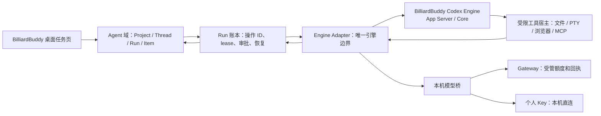

# Codex 源内核迁移

> 状态：Agent 工作台的当前施工模块。已登记固定源码依赖；本文把上游源码变成 BilliardBuddy 自己的可替换执行内核，不把整个 Codex 产品搬进来。

## 1. 已确认的起点

- 上游基线：`openai/codex` commit `ee0247f95a6fe2b094ba2253d82cae2a2b4c2dff`；正式 Git 子模块位于 `third_party/codex-engine/`，其公开来源是 `https://github.com/openai/codex.git`。本机研究副本仍位于 `codex-frontend-reference/upstream-cli-ee0247f/`。
- 上游有成熟的 `app-server`、ThreadState、Turn/Item 事件、审批和工具执行边界；这些正是 BilliardBuddy 当前自研 Harness 最不应继续重复维护的部分。
- 此基线的 `codex-rs/model-provider-info/src/lib.rs` 只接受 `WireApi::Responses`，明确拒绝 `wire_api = "chat"`。
- BilliardBuddy 仍必须支持受管和个人模型的 Chat Completions 与 Responses，且个人 Key 只能在本机受控路径中直连。

结论：不是把原版 Codex 二进制直接启动，也不是再写一套相似的 TypeScript Agent 循环；而是从 Codex 源码形成 BilliardBuddy 管理的执行内核，再由本机模型桥和领域适配器接住产品差异。

## 2. 最终架构

### 2.1 每层只负责什么

| 层 | 最终负责 | 明确不负责 |
| --- | --- | --- |
| Agent 域与 Run 账本 | 用户任务、Item、队列、审批、恢复判定、操作回执 | 模型循环细节、图片画布、视频时间线 |
| Engine Adapter | 一个 BilliardBuddy 任务会话与一个 Codex Thread 的绑定；一次 Run 与该 Thread 上一次 Turn 的绑定；事件顺序、取消、服务端请求回应。未开始 Turn 的新 Thread 不作持久恢复状态 | 项目索引、全局密钥、UI 状态 |
| Codex Engine | 一次 Thread 的 Turn/Item/工具循环、上下文、指令与执行状态 | BilliardBuddy 的业务真相、额度、永久凭据、最终完成裁决 |
| 本机模型桥 | 为引擎提供 Responses 语义，保留上游回执和不确定结果 | 伪造 Chat/Responses 等价性或自动重发不确定操作 |
| 工具宿主 | 在权限信封内执行文件、终端、浏览器、MCP 等窄能力 | 绕过 Run lease 或直接修改领域账本 |

图片和视频不进入 Codex Engine。它们保留自己的 Job、候选/画布或时间线/渲染事实；未来只能以明确的成果引用或受限工具交给 Agent，不能把媒体状态塞进 Thread。

### 2.2 引擎状态不是产品状态

Codex 会保存自己的 Thread、配置与运行资料。BilliardBuddy 启动它时只给它一个由产品创建和管理的**私有引擎目录**，绝不复用用户已有的 Codex 目录、登录态或凭据。该目录中的 Thread 是可替换的执行缓存：删除、损坏或升级后，必须由 Agent 域的任务、Run、Item、操作回执和恢复判定重新建立可继续的执行状态。产品账本才是用户可见历史和副作用裁决的唯一事实来源。

## 3. 模型适配的硬规则

引擎只看到 Responses。BilliardBuddy 的模型桥按实际上游协议分路：

1. 上游已经是 Responses：在保留 `operation_id`、完成标记和工具参数完整性的前提下转发。
2. 上游是 Chat Completions：在本机把完整流转为 Responses Item；增量、未完成 `finish_reason` 或不完整 function arguments 不能交给引擎执行。
3. 模型调用先由 Run 账本写入 intent 和 lease；结果先投影为 Item/回执并完成 checkpoint，才会向引擎确认。
4. 连接断开、超时或引擎/桥崩溃时，不能证明上游未执行的调用必须进入 `outcome_unknown`，不会自动重发。
5. 个人 Key 只通过 Electron Main 的安全存储注入一次私有本机会话；Renderer、Agent Item、Codex 配置文件和 Gateway 都不能得到明文。

## 4. 分段施工与提交边界

每一段都必须有正式消费者、唯一状态归属、实际调用链和中断处理；没有这些的类型、空壳或文档不算完成。

| 段 | 唯一交付 | 完成证据 | 不做 |
| --- | --- | --- | --- |
| A. 源码与构建 | 已锁定的 `third_party/codex-engine`、Apache LICENSE/NOTICE 审计，以及 BilliardBuddy 私有目录中的 stdio 引擎客户端和 Thread 绑定存储；macOS/Windows 可构建 `codex-app-server` | 子模块 revision 与上游来源可复现、许可证清单、两平台构建产物可启动 | 不引入 Codex CLI/TUI/品牌；不发布安装包 |
| B. 模型桥 | 引擎只接 Responses，受管与个人 Chat/Responses 都由本机桥提供同一完整 Item 语义 | 无付费替身覆盖文本、工具调用、不完整流和未知结果 | 不读取或上传真实个人 Key；不自动重试 |
| C. Run 事件桥 | 一个 BilliardBuddy 任务会话绑定一个 Codex Thread；每次 Run 在该 Thread 上启动一次 Turn，按顺序投影 Turn/Item、审批、工具活动、terminal | 新建任务、继续、停止、重启后历史和状态一致 | 不让引擎直接写任务数据库 |
| D. 权限与工具桥 | Codex 的工具请求受 BilliardBuddy lease 和三档权限控制 | 文件、PTY、浏览器、MCP 的许可/拒绝/停止均有可见回执 | 不让工具获得全局凭据或目录外权限 |
| E. 正式切换 | 桌面任务页只消费引擎事件；旧 Harness 无消费者后删除 | 同一用户旅程在新路径完成，旧路径不可再启动 | 不保留双 Harness 作为“兼容” |

当前处于 **A. 源码与构建收口、B. 模型桥准备**。固定源码已经登记；开发机已从该基线构建 macOS arm64 `codex-app-server` 并完成 BilliardBuddy 私有目录中的无模型 stdio 初始化/退出验证。`codex-engine-build.yml` 仍会在 GitHub 的 macOS Apple Silicon 与 Windows x64 runner 上只编译未经签名的 `codex-app-server`，不生成桌面安装包、不上传发布源；由于本地 `main` 尚未安全推送，Windows 构建尚未有实际产物证据。引擎客户端目前只负责私有目录、标准协议与 BilliardBuddy Thread 绑定，尚未接管正式 Run；在模型桥、事件桥和权限桥完整之前，不再给旧 TypeScript Harness 添加模型、工具、Hook 或 UI 功能。

## 5. 许可与发布边界

Codex 的 Apache-2.0 许可允许在满足许可证与 NOTICE 要求时改造和分发。BilliardBuddy 将保留自身名称、桌面 UI、模型身份、任务数据、权限语义和远程服务；上游来源和本地修改必须在源码与发布审计中可追溯。仅把 Git 忽略的研究副本打包进 Electron、或在运行时依赖其绝对路径，都不算源码迁移，也不允许发生。
